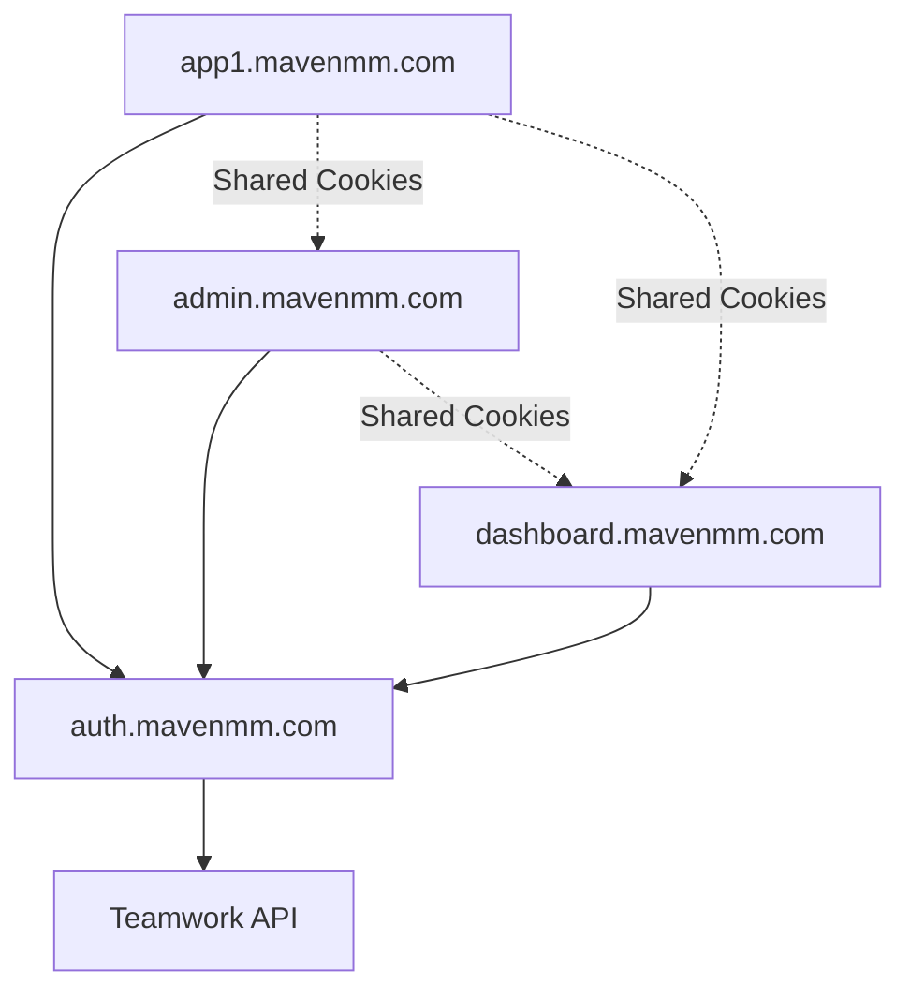

# Teamwork Auth 🚀 v2.0

A centralized React package for Teamwork authentication using an external auth service. **No more copying auth logic between apps!**

## Architecture (v2.0) - Centralized SSO System



### Components:
1. **Frontend Package** (`@mavenmm/teamwork-auth`): React components and hooks for any Maven app
2. **Centralized Auth Service** (`auth.mavenmm.com`): Handles all authentication logic and Teamwork API communication
3. **Maven Apps** (`*.mavenmm.com`): Your applications that need authentication

### Benefits:
- **🔒 Security**: Teamwork API tokens isolated to auth service only
- **🚀 Zero Backend**: Apps just install npm package - no server code needed
- **🌐 SSO**: Login once, authenticated across all `*.mavenmm.com` apps
- **🔧 Maintainable**: Update auth logic in one place for all apps
- **⚡ Fast Setup**: New apps get auth in minutes, not hours

## Installation

```bash
npm install @mavenmm/teamwork-auth @teamwork/login-button react-router-dom
```

## Available Exports

```tsx
// React Components & Hooks (v2.0 - Centralized Auth Service)
import {
  AuthProvider,
  useAuthContext,
  useTeamworkAuth,
  Login,
  type TeamworkAuthConfig
} from '@mavenmm/teamwork-auth';
```

**Requirements:**
- React Router DOM v6+ (peer dependency)
- External auth service running at `auth.mavenmm.com`

## Quick Start (v2.0 - External Auth Service)

### 1. Using the hook directly (Recommended)
```tsx
import React from 'react';
import { useTeamworkAuth, Login, type TeamworkAuthConfig } from '@mavenmm/teamwork-auth';

const authConfig: TeamworkAuthConfig = {
  authServiceUrl: 'https://auth.mavenmm.com',
  cookieDomain: '.mavenmm.com'
};

function App() {
  const { user, loading, isAuthenticated, logout } = useTeamworkAuth(authConfig);

  if (loading) {
    return <div>Loading...</div>;
  }

  if (!isAuthenticated) {
    return <Login />;
  }

  return (
    <div>
      <h1>Welcome, {user?.firstName}!</h1>
      <button onClick={logout}>Logout</button>
    </div>
  );
}
```

### 2. Using AuthProvider (Alternative)
```tsx
import React from 'react';
import { BrowserRouter, Routes, Route } from 'react-router-dom';
import { AuthProvider, useAuthContext } from '@mavenmm/teamwork-auth';

function App() {
  return (
    <BrowserRouter>
      <Routes>
        <Route path="/*" element={<AuthenticatedApp />} />
      </Routes>
    </BrowserRouter>
  );
}

// AuthProvider must be inside Router context (inside a Route element)
function AuthenticatedApp() {
  return (
    <AuthProvider authServiceUrl="https://auth.mavenmm.com">
      <Routes>
        <Route path="/home" element={<Dashboard />} />
        <Route path="/profile" element={<Profile />} />
      </Routes>
    </AuthProvider>
  );
}

function Dashboard() {
  const { user, loading, isAuthenticated, logout } = useAuthContext();

  if (loading) return <div>Loading...</div>;

  return (
    <div>
      <h1>Welcome, {user?.firstName}!</h1>
      <button onClick={logout}>Logout</button>
    </div>
  );
}
```

### 3. No Backend Code Needed! 🎉

**That's it!** No Netlify Functions, no environment variables, no backend setup required in your app.

The external auth service at `auth.mavenmm.com` handles all the backend logic:
- Teamwork OAuth flow
- JWT token management
- Cookie handling for `.mavenmm.com` subdomains
- Authentication validation

## Cookie Domain Configuration 🍪

For subdomain sharing (e.g., sharing auth between `app.yourdomain.com` and `admin.yourdomain.com`):

```bash
# In your .env file
VITE_COOKIE_DOMAIN=.yourdomain.com
```

This allows the authentication cookie to work across all `*.yourdomain.com` subdomains.

**Behavior:**
- **Localhost**: No domain set (works with any localhost port)
- **Production with VITE_COOKIE_DOMAIN**: Cookie shared across subdomains
- **Production without VITE_COOKIE_DOMAIN**: Cookie only works on exact domain

## Features

- 🔐 **Teamwork OAuth** - Uses official Teamwork login button
- 🍪 **Cookie-based Auth** - Secure authentication with HttpOnly cookies
- 🌐 **Subdomain Support** - Configurable cookie sharing across subdomains
- 🔄 **Auto-redirect** - Smart redirect handling between apps
- 📱 **TypeScript** - Full type safety
- ⚡ **Netlify Functions** - Ready-to-use serverless auth handlers
- 🎯 **Vite Optimized** - Built specifically for Vite+React+Netlify stack

## Important Notes 📝

**Router Requirement**: The `AuthProvider` uses React Router hooks (`useNavigate`, `useLocation`) and must be placed inside a Router context. Specifically, it should be inside a Route element, not as a direct child of `<Router>`.

**Environment Variables**: You need both client-side (`VITE_*`) and server-side variables. The client-side variables are for React components, and server-side variables are for Netlify Functions.

## API Reference

### React Components

#### `useTeamworkAuth(config)`

```tsx
const {
  user,           // User | null
  setUser,        // (user: User | null) => void
  loading,        // boolean
  isAuthenticated, // boolean
  login,          // (code: string) => Promise<{twUser: User}>
  logout          // () => Promise<void>
} = useTeamworkAuth({
  authServiceUrl: 'https://auth.mavenmm.com',
  cookieDomain: '.mavenmm.com'
});
```

#### `<Login>`

```tsx
<Login />  // Uses environment variables for configuration
```

### Auth Service Endpoints (auth.mavenmm.com)

#### `POST /.netlify/functions/login`
- **Headers**: `code` (OAuth authorization code)
- **Response**: `{ twUser: User }`
- **Sets**: `maven_auth_token` cookie (HttpOnly, secure)

#### `GET /.netlify/functions/logout`
- **Response**: `{ success: true }`
- **Clears**: `maven_auth_token` cookie

#### `GET /.netlify/functions/checkAuth`
- **Response**: `{ authenticated: boolean, userId?: string }`
- **Validates**: `maven_auth_token` JWT cookie

### Types

```tsx
interface User {
  id: string;
  firstName: string;
  lastName: string;
  email: string;
  avatar: string;
  company: {
    id: number;
    name: string;
    logo: string;
  };
}
```

## Multi-Site Integration Example

Adding auth to a new Maven app (e.g., `app1.mavenmm.com`):

```tsx
// Just install and configure - no backend code needed!
import { useTeamworkAuth, Login } from '@mavenmm/teamwork-auth';

const authConfig = {
  authServiceUrl: 'https://auth.mavenmm.com',
  cookieDomain: '.mavenmm.com'  // Enables SSO across subdomains
};

function App() {
  const { user, isAuthenticated, logout } = useTeamworkAuth(authConfig);

  if (!isAuthenticated) return <Login />;

  return (
    <div>
      <h1>Welcome to app1.mavenmm.com, {user?.firstName}!</h1>
      <button onClick={logout}>Logout</button>
    </div>
  );
}
```

**That's it!** The user will be automatically authenticated if they're logged in to any other Maven app.

## Troubleshooting

### Common Issues

#### 🚫 "User not authenticated" but should be logged in

**Symptoms**: App shows login screen even though user logged in elsewhere
**Causes**:
- Incorrect `cookieDomain` configuration
- App not on `*.mavenmm.com` subdomain
- Auth service unreachable

**Solutions**:
```tsx
// 1. Check cookie domain configuration
const authConfig = {
  cookieDomain: '.mavenmm.com'  // Must include the dot!
};

// 2. Verify subdomain
// ✅ Good: app1.mavenmm.com, admin.mavenmm.com
// ❌ Bad: app1.mavenmarketing.com, localhost:3000

// 3. Test auth service
fetch('https://auth.mavenmm.com/.netlify/functions/checkAuth')
  .then(res => console.log('Auth service status:', res.status));
```

#### 🔄 Login button doesn't work

**Symptoms**: Clicking login does nothing or shows errors
**Causes**:
- CORS issues between app and auth service
- Auth service environment variables missing
- Teamwork OAuth app misconfigured

**Solutions**:
```bash
# 1. Check browser console for CORS errors
# 2. Verify auth service is deployed and accessible
curl https://auth.mavenmm.com/.netlify/functions/checkAuth

# 3. Check Teamwork OAuth app redirect URIs include your app domain
```

#### 🍪 Authentication doesn't persist after page refresh

**Symptoms**: User logged out after browser refresh
**Causes**:
- Cookies not being set properly
- Incorrect cookie domain
- Auth service issues

**Solutions**:
```tsx
// Check browser dev tools > Application > Cookies
// Should see 'maven_auth_token' cookie for .mavenmm.com domain

// Debug authentication status
const { user, loading, isAuthenticated } = useTeamworkAuth(authConfig);
console.log('Auth debug:', { user, loading, isAuthenticated });
```

#### ⚠️ CORS errors in browser console

**Symptoms**: Network errors when calling auth service
**Causes**:
- Auth service CORS not configured for your domain
- Using HTTP instead of HTTPS in production

**Solutions**:
```bash
# 1. Ensure your app domain is added to auth service CORS allowlist
# 2. Use HTTPS in production (required for cookies)
# 3. Check Origin header matches your domain exactly
```

#### 🔐 Environment variable issues

**Symptoms**: Login process fails with authentication errors
**Causes**:
- Missing or incorrect Teamwork OAuth credentials
- JWT secrets not configured

**Solutions**:
```bash
# Auth service needs these environment variables:
VITE_CLIENT_ID=your_teamwork_client_id
VITE_CLIENT_SECRET=your_teamwork_client_secret
VITE_REDIRECT_URI=https://your-app-domain.com
JWT_KEY=secure_random_jwt_secret

# Apps only need auth service URL (no secrets):
const authConfig = {
  authServiceUrl: 'https://auth.mavenmm.com'
};
```

### Debug Mode

Enable detailed logging to troubleshoot issues:

```tsx
// Temporarily add for debugging
const authConfig = {
  authServiceUrl: 'https://auth.mavenmm.com',
  cookieDomain: '.mavenmm.com',
  debug: true  // Enables console logging
};
```

### Getting Help

1. **Check browser console** for error messages
2. **Verify network requests** in browser dev tools
3. **Test auth service directly** with curl commands
4. **Review documentation**:
   - `INTEGRATION.md` - Step-by-step integration guide
   - `SECURITY.md` - Security best practices
   - `DEPLOYMENT.md` - Auth service deployment

## Project Structure

```
@mavenmm/teamwork-auth/
├── src/                    # Frontend package source
│   ├── hooks/
│   │   └── useTeamworkAuth.ts
│   ├── components/
│   │   └── Login.tsx
│   └── providers/
│       └── AuthProvider.tsx
├── auth-service/           # Centralized auth service
│   ├── functions/
│   │   ├── login.ts
│   │   ├── logout.ts
│   │   └── checkAuth.ts
│   └── middleware/
├── test-app/              # Local testing app
├── INTEGRATION.md         # Integration guide
├── SECURITY.md           # Security documentation
└── DEPLOYMENT.md         # Deployment guide
```

---

Made with ❤️ by Maven Marketing