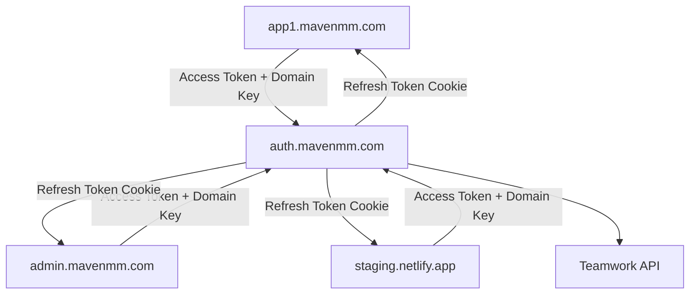

# Teamwork Auth 🚀 v2.0

**High-security centralized authentication for Maven Marketing applications**

A React package and auth service providing enterprise-grade Teamwork SSO with dual-token architecture, domain authentication keys, and comprehensive security features.

## Architecture v2.0 - High Security SSO



### Components:
1. **Frontend Package** (`@mavenmm/teamwork-auth`): React hooks and components
2. **Auth Service** (`auth.mavenmm.com`): Centralized authentication server
3. **Dual-Token System**: 15-min access tokens + 7-day refresh tokens
4. **Domain Keys**: Unique authentication keys per application

### Security Features:
- 🔐 **Short-lived tokens**: 15-minute access tokens reduce exposure window
- 🔄 **Token rotation**: Refresh tokens are single-use
- 🔑 **Domain authentication**: Prevents domain spoofing attacks
- 🚫 **Token blacklisting**: Immediate revocation on logout
- ⚡ **Rate limiting**: Brute force protection
- 🛡️ **CSP headers**: XSS protection

## Quick Start

### Installation

```bash
npm install @mavenmm/teamwork-auth
```

### Basic Usage

```tsx
import { useTeamworkAuth } from '@mavenmm/teamwork-auth';

function App() {
  const { user, isAuthenticated, logout, getAccessToken } = useTeamworkAuth({
    domainKey: process.env.VITE_DOMAIN_KEY
  });

  if (!isAuthenticated) {
    return <LoginScreen />;
  }

  return (
    <div>
      <h1>Welcome, {user?.firstName}!</h1>
      <button onClick={logout}>Logout</button>
    </div>
  );
}
```

### Making API Calls

```tsx
const { getAccessToken } = useTeamworkAuth();

// Access token automatically refreshes
const response = await fetch('/api/data', {
  headers: {
    'Authorization': `Bearer ${getAccessToken()}`,
    'X-Domain-Key': process.env.VITE_DOMAIN_KEY,
  },
  credentials: 'include', // Required for refresh token cookie
});
```

## What's New in v2.0

### 🔐 Security Enhancements
- **Dual-token strategy**: Reduced token exposure time (15min vs 2 weeks)
- **Domain authentication keys**: Each domain requires unique secret key
- **Explicit whitelisting**: Both `*.mavenmm.com` and `*.netlify.app` require registration
- **Token rotation**: Refresh tokens are single-use
- **Rate limiting**: Protection against brute force attacks
- **Enhanced headers**: Content-Security-Policy and security headers

### ⚡ Developer Experience
- **Auto-refresh**: Tokens refresh automatically 1 minute before expiry
- **Zero config**: Auto-detects localhost vs production
- **Better errors**: Helpful error messages guide developers
- **TypeScript**: Full type safety throughout

### 🌐 Cross-Domain Support
Works across:
- `*.mavenmm.com` (production)
- `*.netlify.app` (staging)
- `localhost:*` (development)

## Migration from v1

**⚠️ Breaking Changes**: v2 uses a completely new authentication architecture.

See [MIGRATION_V2.md](MIGRATION_V2.md) for detailed migration guide.

**Key changes:**
1. Access tokens now in `Authorization` header (not just cookies)
2. Domain keys required via `X-Domain-Key` header
3. Each domain must be registered in auth service
4. Token refresh handled automatically by hook

## Configuration

### Environment Variables

**Your Application** (`.env`):
```bash
# Domain authentication key (get from auth service team)
VITE_DOMAIN_KEY=dmk_your_app_secret_key
```

**Auth Service** (`auth-service/.env`):
```bash
# Teamwork OAuth credentials
VITE_CLIENT_ID=your_teamwork_client_id
VITE_CLIENT_SECRET=your_teamwork_client_secret
VITE_REDIRECT_URI=https://your-app.mavenmm.com

# JWT secrets
JWT_KEY=your_jwt_secret
JWT_REFRESH_KEY=your_refresh_secret

# Domain keys for registered apps
DOMAIN_KEY_APP1=dmk_app1_secret
DOMAIN_KEY_ADMIN=dmk_admin_secret
```

## API Reference

### `useTeamworkAuth(config?)`

Main authentication hook with auto-refresh capabilities.

```tsx
const {
  user,              // User | null
  isAuthenticated,   // boolean
  loading,           // boolean
  error,             // string | null
  login,             // (code: string) => Promise<{user: User}>
  logout,            // () => Promise<void>
  getAccessToken,    // () => string | null
  authServiceUrl,    // string
} = useTeamworkAuth({
  domainKey: string,        // Optional - reads from env
  authServiceUrl: string,   // Optional - auto-detects
});
```

**Features:**
- ✅ Automatic token refresh (1 min before expiry)
- ✅ Handles token rotation
- ✅ Stores access token securely in memory
- ✅ Manages refresh token via httpOnly cookie
- ✅ Environment auto-detection

### Configuration Options

```tsx
interface TeamworkAuthConfig {
  // Optional - domain authentication key
  // Falls back to VITE_DOMAIN_KEY env variable
  domainKey?: string;

  // Optional - auth service URL
  // Auto-detects: localhost:9100 vs auth.mavenmm.com
  authServiceUrl?: string;
}
```

### User Type

```tsx
interface User {
  id: string;
  firstName: string;
  lastName: string;
  email: string;
  avatar: string;
  company: {
    id: number;
    name: string;
    logo: string;
  };
}
```

## Auth Service Endpoints

All endpoints require:
- `Origin` header (must be registered)
- `X-Domain-Key` header (domain authentication key)

### `POST /.netlify/functions/login`
- **Headers**: `code` (OAuth code), `X-Domain-Key`
- **Response**: `{ accessToken, expiresIn, user, redirectTo }`
- **Sets Cookie**: `maven_refresh_token` (httpOnly, 7 days)

### `POST /.netlify/functions/refresh`
- **Headers**: `X-Domain-Key`
- **Cookie**: `maven_refresh_token`
- **Response**: `{ accessToken, expiresIn, tokenType }`
- **Note**: Rotates refresh token (single-use)

### `GET /.netlify/functions/checkAuth`
- **Headers**: `Authorization: Bearer <token>`, `X-Domain-Key`
- **Response**: `{ authenticated, userId, expiresAt }`

### `GET /.netlify/functions/logout`
- **Headers**: `Authorization: Bearer <token>`, `X-Domain-Key`
- **Effect**: Blacklists both access and refresh tokens
- **Response**: `{ success: true }`

## Security Best Practices

1. **Domain Keys**: Never commit domain keys to git
2. **HTTPS Only**: Use HTTPS in production
3. **Token Storage**: Access tokens stored in memory (not localStorage)
4. **Refresh Tokens**: httpOnly cookies prevent XSS access
5. **Rate Limiting**: Automatic protection against brute force
6. **Token Rotation**: Refresh tokens are single-use
7. **Blacklisting**: Logout immediately revokes tokens

See [SECURITY.md](SECURITY.md) for comprehensive security documentation.

## Documentation

- **[MIGRATION_V2.md](MIGRATION_V2.md)** - Upgrading from v1 to v2
- **[INTEGRATION.md](INTEGRATION.md)** - Adding auth to new apps
- **[DEPLOYMENT.md](DEPLOYMENT.md)** - Deploying auth service
- **[LOCAL_TESTING.md](LOCAL_TESTING.md)** - Local development setup
- **[SECURITY.md](SECURITY.md)** - Security architecture and best practices

## Troubleshooting

### Domain Not Registered
```
Error: Domain validation failed
Message: Domain not registered. Contact security@mavenmm.com
```
**Solution**: Add your domain to `functions/config/domains.ts`

### Invalid Domain Key
```
Error: Invalid domain key
```
**Solution**: Check `VITE_DOMAIN_KEY` environment variable matches registered key

### Token Expired
The hook automatically refreshes tokens. If you see this error:
1. Check that `credentials: 'include'` is set in fetch requests
2. Verify refresh token cookie is being sent
3. Check auth service is accessible

### Auth Service Unreachable
```
⚠️ Auth service not running on localhost:9100
```
**Solution**: Start auth service: `cd auth-service && npm run dev`

## Project Structure

```
├── teamwork-auth/           # NPM package source
│   └── src/
│       ├── hooks/
│       │   └── useTeamworkAuth.ts
│       └── types/
│           └── index.ts
├── functions/               # Auth service (Netlify Functions)
│   ├── config/
│   │   └── domains.ts       # Domain registry
│   ├── middleware/
│   │   ├── validateDomain.ts
│   │   ├── rateLimit.ts
│   │   └── cors.ts
│   ├── utils/
│   │   ├── tokenManager.ts  # Token creation/validation
│   │   └── securityHeaders.ts
│   ├── login.ts
│   ├── refresh.ts           # NEW in v2
│   ├── checkAuth.ts
│   └── logout.ts
├── MIGRATION_V2.md          # v1 → v2 migration guide
├── INTEGRATION.md           # Integration guide
├── DEPLOYMENT.md            # Deployment guide
├── SECURITY.md              # Security documentation
└── LOCAL_TESTING.md         # Local development

```

## Contributing

This is an internal Maven Marketing package. For questions or issues:

1. Check [MIGRATION_V2.md](MIGRATION_V2.md) for common issues
2. Review [SECURITY.md](SECURITY.md) for security guidelines
3. Contact the platform team

## License

Internal use only - Maven Marketing

---

**Need help?** See [MIGRATION_V2.md](MIGRATION_V2.md) or contact the platform team.
